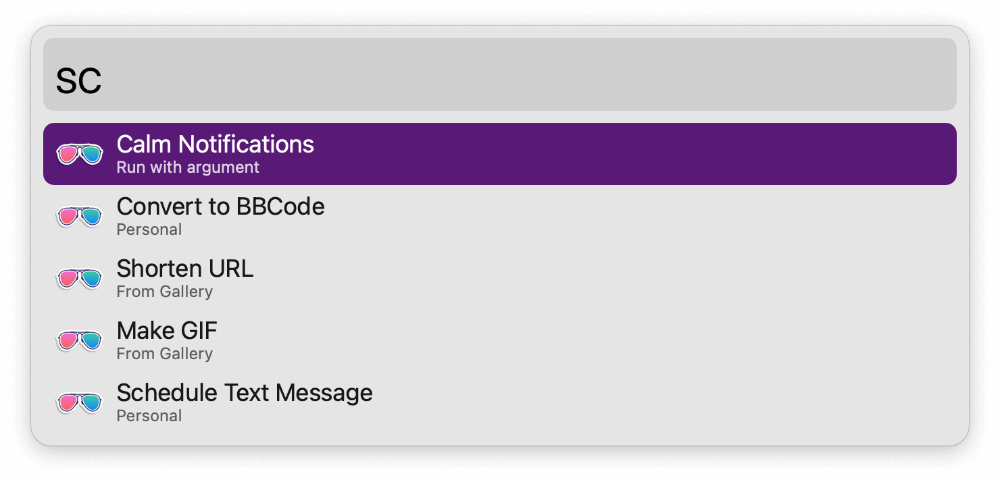

#  Shortcuts Alfred Workflow

Run installled macOS shortcuts

<a href='https://github.com/alfredapp/shortcuts-workflow/releases/latest/download/Shortcuts.alfredworkflow'>⤓ Download Workflow</a>

## About

Run `sc` to list all your shortcuts or `scd` to quickly filter them by folder name. Press ↩ to action.

To run a shortcut with an argument, use the Universal Action or invoke it with ⌘↩. Use the File Action to run a shortcut on a file.

⌥↩ opens the the shortcut for editing.

<a href='https://github.com/alfredapp/shortcuts-workflow/releases/latest/download/Shortcuts.alfredworkflow'>⤓ Download Workflow</a>
