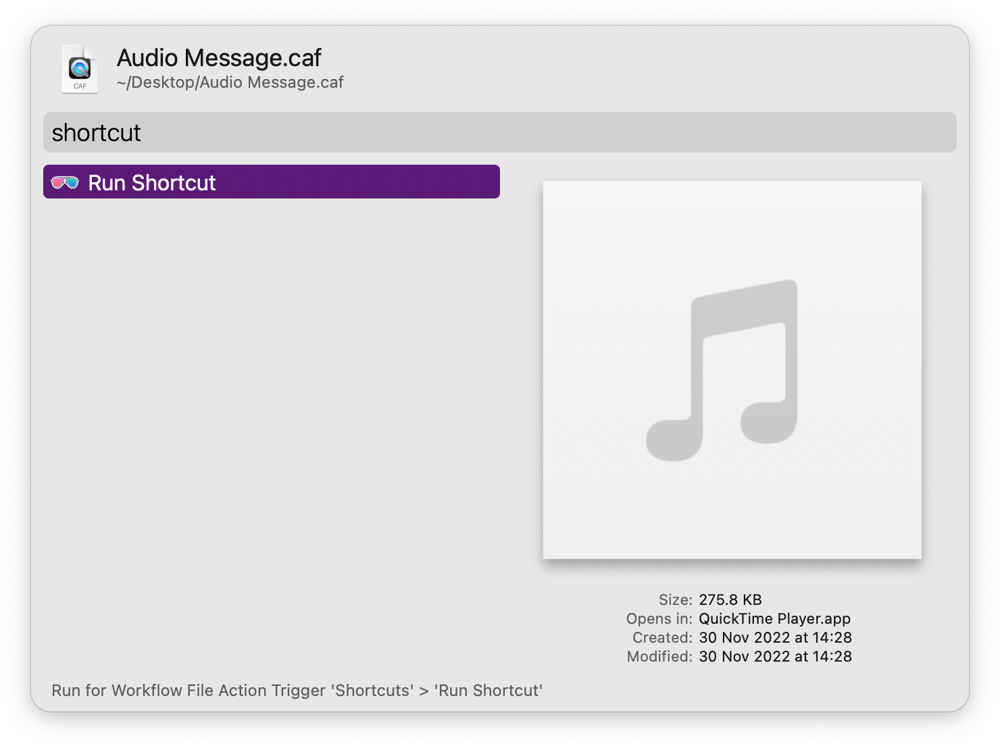

#  Shortcuts Alfred Workflow

Run installed macOS shortcuts

[⤓ Install on the Alfred Gallery](https://alfred.app/workflows/alfredapp/shortcuts)

## Usage

Search all your shortcuts via the `sc` keyword or search by folder name with `scd`. Configure the [Hotkey](https://www.alfredapp.com/help/workflows/triggers/hotkey/) for faster triggering of the former.

* <kbd>↩&#xFE0E;</kbd> Run the shortcut.
* <kbd>⌘</kbd><kbd>↩&#xFE0E;</kbd> Run the shortcut with an argument.
* <kbd>⌥</kbd><kbd>↩&#xFE0E;</kbd> Open the shortcut for editing.

Use the [Universal Action](https://www.alfredapp.com/help/features/universal-actions/) to run the shortcut on files or as another way to provide an argument. Only shortcuts which accept input will be listed.

